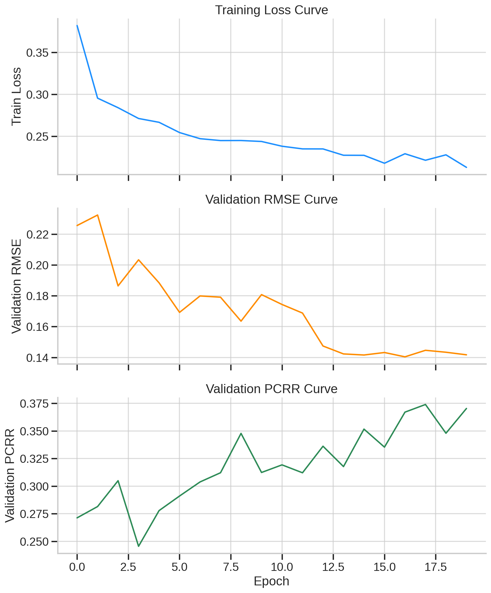
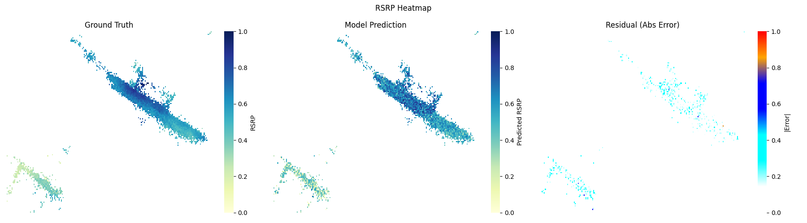

# WIPM 📡 Neural Diffusion for Wireless Propagation Modeling

A deep learning project for generalizable signal map reconstruction using **Neural Diffusion Processes (NDP)**. This work adapts the diffusion modeling paradigm to predict spatially distributed wireless signal strength (RSRP) using sparse measurements and environmental features.

---

## 🌐 Background & Motivation

In wireless communication systems, accurate modeling of the **radio signal propagation** is crucial for coverage analysis, blind spot detection, and network optimization.

Traditional propagation models (e.g., COST231, ray tracing) rely on analytical approximations or heavy simulations, which can be:
- Computationally expensive
- Limited in generalization across urban layouts
- Ineffective under sparse measurement conditions

To address these challenges, we adopt **Neural Diffusion Processes (NDP)**—a recent generative approach that models uncertainty and enables spatial interpolation of signal fields, especially under sparsity.

---

## 🚀 Method Overview

Our approach leverages a denoising diffusion process to model the distribution over RSRP values given spatial and contextual input features.

### 🔧 Key Components

- **Feature Engineering**: 
  Precomputed from raw cell information and grid topology (distance, relative altitude, azimuth error, clutter type, tilt).

- **NDP Framework**:
  - Predicts the noise added at each step of the diffusion process
  - Learns to denoise the signal representation iteratively
  - Incorporates bidimensional multi-head attention for spatial dependencies

- **Training Objective**: 
  Pure MSE loss between predicted and ground-truth noise across diffusion steps.

- **Evaluation Metrics**:
  - RMSE (Root Mean Square Error)
  - PCRR (Percentage of Correctly Recognized RSRP over threshold)

---

## 📁 Project Structure

```bash
.
├── datasets/              # Preprocessed training and evaluation CSVs
├── configs/               # YAML training config files
├── results/               # Checkpoints, logs, plots
├── src/
│   ├── scripts/           # Helper scripts for data processing and visualization
│   ├── data.py            # Dataset class & data split helpers
│   ├── ndp.py             # Core diffusion model implementation
│   ├── metrics.py         # RMSE and PCRR metrics
│   └── train.py           # Training loop with LR scheduler
└── README.md              # Documentation
```

---

## ⚙️ Usage

### 1. 📦 Install Requirements
```bash
pip install -r requirements.txt
```

### 2. 🏗️ Preprocess Data
```bash
python scripts/preprocess_data.py --input raw.csv --output datasets/processed.csv
```

### 3. 🧪 Train Model
```bash
python -m src.train --cfg configs/base.yaml
```

### 4. 📊 Visualize Results
```bash
python scripts/visualize_rsrp.py \
  --csv datasets/eval_site.csv \
  --cfg configs/base.yaml \
  --ckpt results/checkpoints/ndp_best.pt \
  --residual
```

---

## 📈 Example Outputs

- **Training Loss, Validation RMSE & PCRR curves**
- **RSRP heatmaps** for both ground-truth and predictions
- **Residual maps** to visualize model error





---

## 🧠 Highlights

- Supports arbitrary-resolution signal maps
- Generalizes across cell layouts with unified training
- Uses realistic feature sets for wireless modeling
- Includes reproducible training pipeline and visualizations

---

## 📚 References
- [Neural Diffusion Processes (ICML 2023)](https://arxiv.org/abs/2306.03992)
- Torch-based reimplementation of original TensorFlow code

---

## ✍️ Author
[Rvosuke](https://github.com/Rvosuke)
Please cite or acknowledge if using or referencing this work.
